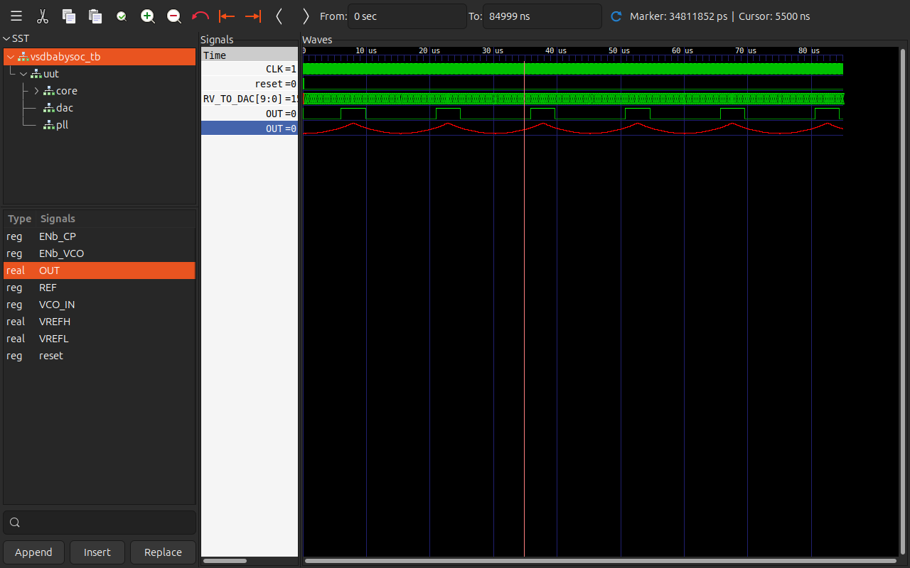
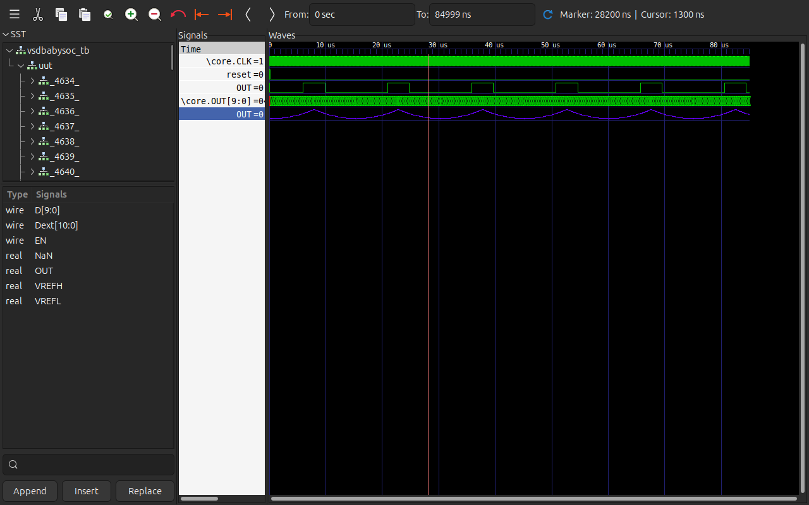
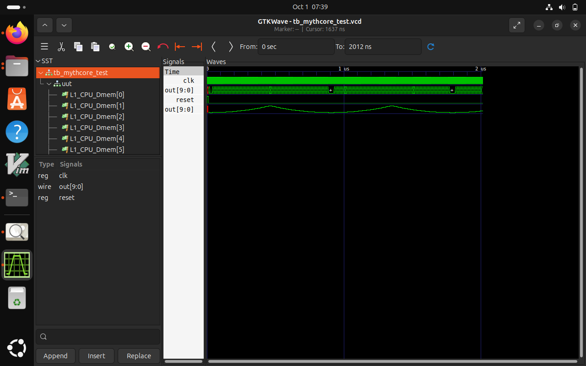

# Introduction
VSDbabySoC is a compact SoC design that includes a RISCV-based processor named RVMYTH, along with analog components like a PLL (Phase-Locked Loop) and DAC (Digital-to-Analog Converter). It serves as a practical platform to explore and simulate the integration of digital and analog circuits in a modern chip design.
# Pre synthesis simulation
Pre-synthesis simulation of BabySoC involves verifying the RTL code behavior before synthesizing it into hardware. It checks the functional correctness of the design using test benches without considering gate-level details, ensuring the logic functions as intended. This step helps catch errors early in the design flow before moving to synthesis and physical implementation.

```
cd VSDBabySoc
make pre_synth_sim
```
This command lines generates vcd file of pre_synth_sim from the  makefile present in the directory VSDBabySoC

```
gtkwave output/pre_synth_sim/pre_synth_sim.vcd

GTKwave Analyzer v3.3.116 (w)1999-2000 BSI

[0] start time
[84999000] end time
```
  

This is the gtkwave simulation of the RTL behavior of vsdbabysoc.


In the image:

**CLK**: Input clock signal to the RVMYTH core, originally sourced from the PLL.

**reset**: Input reset signal to the RVMYTH core, originally from an external source.

**OUT (digital)**: Output signal from the VSDBabySoC module, originating from the DAC. Due to simulation limits, this behaves as a digital signal but represents an analog output.

**RV_TO_DAC[9:0]**: 10-bit output port [9:0] from the RVMYTH core, connected to register #17.

**OUT (analog)**: Real datatype wire simulating analog values, the output wire from the DAC module.

**Explanation:**
The clock is generated with a PLL (Phase locked loop) and drives the RVMYTH CPU core to simulate results based on the ISA of the core(RISC-V here).In this simulation, the RVMYTH core is continuously sending 10-bit digital values (RV_TO_DAC[9:0]) to the DAC. The first OUT signal is the digital representation of the DAC.Since the DAC converts these digital steps into a real value, the output (red waveform) does not appear as a flat digital line but instead forms smooth wave of analog values.

# Post synthesis simulation

After synthesis with Yosys, the design is converted from RTL code into a gate-level netlist. The post-synthesis simulation runs this gate-level version, so the waveforms may look a bit more detailed or slightly delayed compared to pre-synthesis (because now actual gates, flip-flops, and propagation delays are modeled). Functionally, the behavior remains the same as the RTL simulation, which helps confirm that the synthesis process did not break the design.

```
gtkwave output/post_synth_sim/post_synth_sim.vcd

GTKwave Analyzer v3.3.116 (w)1999-2000 BSI

[0] start time
[84999000] end time
```
 
 
**Explanation:**

In the post-synthesis simulation, the clock from the PLL drives the RVMYTH core, while reset makes sure the design starts in a known state. Once running, the core pushes out 10-bit data from register #17 on its OUT[9:0] bus. This data goes into the DAC, which then produces two forms of output in the simulation: a digital OUT (just for representation) and a real OUT that shows the actual analog behavior. This flow confirms that, even after synthesis, the signals move correctly from the core to the DAC and finally into an analog waveform.

# RVMYTH simulation

 

This waveform shows the RVMYTH CPU core running in simulation. The clock (clk) at the top is the driving signal that keeps the CPU running, toggling at a steady rate. The reset signal is low here, which means the CPU is active and executing instructions. The core produces 10-bit output values on out[9:0], and you can see those bits rapidly toggling as the CPU processes data. These digital values are then combined into the smooth curve below, which is a real-valued representation of the output. The rising and falling pattern of this curve reflects the CPU’s internal operation, as it continuously updates register values and sends them out.
